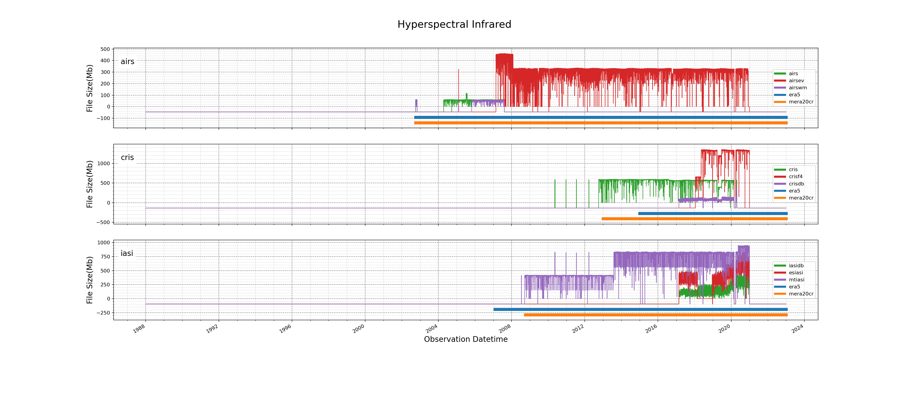

Tools and utilities to catalogue and evaluate observation files.

# Installation and Environment Setup
Some of the observation inventory utils functionality relies on intel 
compilers, the nceplibs-bufr repo managed by EMC, and the UFS-RNR anaconda
python module. As such, these tools/modules must also be installed.

1. Clone the observation-inventory-utils repo.
```sh
$ git clone https://github.com/noaa-psd/observation-inventory-utils.git
```

2. Install or setup the UFS-RNR anaconda3 python environment. If the UFS-RNR
anaconda python environment is not already available, install it now using the
instructions found in the [UFS-RNR-stack](https://github.com/HenryWinterbottom-NOAA/UFS-RNR-stack.git) repo.  An example of the actual
installation script can be found at [scripts/build.UFS-RNR-stack.RDHPCS-Hera.anaconda3.sh](https://github.com/HenryWinterbottom-NOAA/UFS-RNR-stack/blob/0b0fd767928ebc56be0c1992b141015d9e3ff7a4/scripts/build.UFS-RNR-stack.RDHPCS-Hera.anaconda3.sh).
If you are installing this anaconda module at a different location than what
is configured in the above script, you will need to make modifications such
that the install location matches your desired location.  You will also need to
specify aws credentials for PSL's private s3 bucket.


1. Load the anaconda3 environment
```sh
$ module purge
$ module use -a /contrib/home/builder/UFS-RNR-stack/modules
$ module load anaconda3
```

4. Load the Intel 2018 compiler.

```sh
$ module load intel/18.0.5.274
$ module load impi/2018.4.274
```

5. Point to where the forked version of [NCEPLIBS-bufr](https://github.com/jack-woollen/NCEPLIBS-bufr.git) repo is installed or build
those executables by following the `How to Build and Install` instructions. In
other words, add the location of the NCEPLIBS-bufr executables in your PATH
environment variable.  Examples of these utilities exist here:
 [https://github.com/jack-woollen/NCEPLIBS-bufr/tree/develop/utils](https://github.com/jack-woollen/NCEPLIBS-bufr/tree/develop/utils)

```sh
$ export PATH=/contrib/home/builder/nceplibs-bufr/build/utils:$PATH
```


# Table Schemas

The observation inventory utilities package primarily is capable of three
functions, search PSL's observation archive, plot each file types file_size
over the date range January 1st 1990 to January 1st 2021, and harvest the
observation counts specified within each file type.  The results from the two
different queries are stored in an sqlite database for easy access at a later
time.  The results of each command given to determine the file meta of all
observation files related to a given cycle is also stored in a table
`cmd_results`.


```sh
cmd_results

CREATE TABLE cmd_results (
	cmd_result_id INTEGER NOT NULL, 
	command VARCHAR, 
	arg0 VARCHAR, 
	raw_output VARCHAR, 
	raw_error VARCHAR, 
	error_code VARCHAR, 
	obs_day DATETIME, 
	submitted_at DATETIME, 
	latency VARCHAR, 
	inserted_at DATETIME, 
	PRIMARY KEY (cmd_result_id)
```

```sh
obs_inventory

CREATE TABLE obs_inventory (
	cmd_result_id INTEGER NOT NULL, 
	obs_id INTEGER NOT NULL, 
	filename VARCHAR, 
	parent_dir VARCHAR, 
	platform VARCHAR, 
	s3_bucket VARCHAR, 
	prefix VARCHAR, 
	cycle_tag VARCHAR, 
	data_type VARCHAR, 
	cycle_time INTEGER, 
	obs_day DATETIME, 
	data_format VARCHAR, 
	suffix VARCHAR, 
	nr_tag BOOLEAN, 
	file_size INTEGER, 
	permissions VARCHAR, 
	last_modified DATETIME, 
	inserted_at DATETIME, 
	PRIMARY KEY (obs_id), 
	FOREIGN KEY(cmd_result_id) REFERENCES cmd_results (cmd_result_id)
```

```sh
obs_meta_nceplibs_bufr

CREATE TABLE obs_meta_nceplibs_bufr (
	meta_id INTEGER NOT NULL, 
	obs_id INTEGER NOT NULL, 
	cmd_result_id INTEGER NOT NULL, 
	cmd_str VARCHAR, 
	sat_id INTEGER, 
	sat_id_name VARCHAR, 
	obs_count INTEGER, 
	sat_inst_id INTEGER, 
	sat_inst_desc VARCHAR, 
	filename VARCHAR, 
	file_size INTEGER, 
	obs_day DATETIME, 
	inserted_at DATETIME, 
	PRIMARY KEY (meta_id), 
	FOREIGN KEY(obs_id) REFERENCES obs_inventory (obs_id), 
	FOREIGN KEY(cmd_result_id) REFERENCES cmd_results (cmd_result_id)
```

```sh
obs_meta_nceplibs_prepbufr

CREATE TABLE obs_meta_nceplibs_prepbufr (
	meta_id INTEGER NOT NULL, 
	obs_id INTEGER NOT NULL, 
	cmd_result_id INTEGER NOT NULL, 
	cmd_str VARCHAR, 
	typ INTEGER, 
  tot INTETER,
	qm0thru3 INTEGER,
  qm4thru7 INTEGER,
  qm8 INTEGER,
  qm9 INTEGER,
  qm10 INTEGER,
  qm11 INTEGER,
  qm12 INTEGER,
  qm13 INTEGER,
  qm14 INTEGER,
  qm15 INTEGER,
  cka INTEGER,
  ckb INTEGER, 
	filename VARCHAR, 
	file_size INTEGER, 
	obs_day DATETIME, 
	inserted_at DATETIME, 
	PRIMARY KEY (meta_id), 
	FOREIGN KEY(obs_id) REFERENCES obs_inventory (obs_id), 
	FOREIGN KEY(cmd_result_id) REFERENCES cmd_results (cmd_result_id)
```

```sh
obs_meta_nceplibs_prepbufr_aggregate

CREATE TABLE obs_meta_nceplibs_prepbufr (
	meta_id INTEGER NOT NULL, 
	obs_id INTEGER NOT NULL, 
	cmd_result_id INTEGER NOT NULL, 
	cmd_str VARCHAR, 
	typ INTEGER, 
  tot INTETER,
	qm0thru3 INTEGER,
  qm4thru7 INTEGER,
  qm8 INTEGER,
  qm9 INTEGER,
  qm10 INTEGER,
  qm11 INTEGER,
  qm12 INTEGER,
  qm13 INTEGER,
  qm14 INTEGER,
  qm15 INTEGER,
  cka INTEGER,
  ckb INTEGER, 
	filename VARCHAR, 
	file_size INTEGER, 
	obs_day DATETIME, 
	inserted_at DATETIME, 
	PRIMARY KEY (meta_id), 
	FOREIGN KEY(obs_id) REFERENCES obs_inventory (obs_id), 
	FOREIGN KEY(cmd_result_id) REFERENCES cmd_results (cmd_result_id)
```

Information regarding the values in the columns for the prepbufr tables can be found from the EMC documentation for [typ](https://www.emc.ncep.noaa.gov/mmb/data_processing/prepbufr.doc/table_2.htm)
and [quality markers](https://www.emc.ncep.noaa.gov/mmb/data_processing/prepbufr.doc/table_7.htm)

Example row data from the cmd_results table. Note: an error_code with a
negative value indicates that the command failed.  The reason for the command
failure can be found in the raw_error column.

```
$ sqlite3  observations_inventory.db

sqlite> select cmd_result_id, command, arg0, error_code, obs_day, latency, submitted_at from cmd_results order by inserted_at desc limit 1;

cmd_result_id  command     arg0                                                                                                                  error_code  obs_day                     latency     submitted_at              
-------------  ----------  ---------------------------------------------------------------------------------------------                         ----------  --------------------------  ----------  --------------------------
51             sinv        /lustre/work/1abffaa1-7ee1-4e8c-9f46-e15d33e04f8f/20150103/gdas.t06z.1bhrs4.tm00.bufr_d/gdas.t06z.1bhrs4.tm00.bufr_d  0           2015-01-03 06:00:00.000000  0.300152    2022-07-05 16:44:07.318004
```

Example row data from the obs_inventory table.

```
$ sqlite3 observations_inventory.db

sqlite> select obs_id, filename, platform, s3_bucket, cycle_tag, obs_day, file_size, last_modified, inserted_at from obs_inventory order by inserted_at desc limit 3;

obs_id      filename                         platform    s3_bucket            cycle_tag       obs_day                     file_size   last_modified               inserted_at               
----------  -------------------------------  ----------  -------------------  --------------  --------------------------  ----------  --------------------------  --------------------------
601         gefsv13_bufr.20150103120000.md5  aws_s3      noaa-reanalyses-pds  20150103120000  2015-01-03 12:00:00.000000  2518        2022-05-25 23:03:12.000000  2022-07-05 16:43:32.124680
600         gdas.t12z.vadwnd.tm00.bufr_d.nr  aws_s3      noaa-reanalyses-pds  t12z            2015-01-03 12:00:00.000000  378872      2022-05-25 23:03:12.000000  2022-07-05 16:43:32.124638
599         gdas.t12z.updated.status.tm00.b  aws_s3      noaa-reanalyses-pds  t12z            2015-01-03 12:00:00.000000  10287       2022-05-25 23:03:12.000000  2022-07-05 16:43:32.124602
```

Example row data from the obs_meta_nceplibs_bufr table.

```
$ sqlite3 observations_inventory.db

sqlite> select * from obs_meta_nceplibs_bufr order by inserted_at desc limit 5;

meta_id     obs_id      cmd_result_id  cmd_str     sat_id      sat_id_name  obs_count   sat_inst_id  sat_inst_desc  filename                      file_size   obs_day                     inserted_at               
----------  ----------  -------------  ----------  ----------  -----------  ----------  -----------  -------------  ----------------------------  ----------  --------------------------  --------------------------
90          493         51             sinv        223         NOAA 19      179480      607                         gdas.t06z.1bhrs4.tm00.bufr_d  29697936    2015-01-03 06:00:00.000000  2022-07-05 16:44:07.750504
89          493         51             sinv        209         NOAA 18      179592      607                         gdas.t06z.1bhrs4.tm00.bufr_d  29697936    2015-01-03 06:00:00.000000  2022-07-05 16:44:07.750465
88          493         51             sinv        4           METOP-2      179554      607                         gdas.t06z.1bhrs4.tm00.bufr_d  29697936    2015-01-03 06:00:00.000000  2022-07-05 16:44:07.750433
87          493         51             sinv        3           METOP-1      179744      607                         gdas.t06z.1bhrs4.tm00.bufr_d  29697936    2015-01-03 06:00:00.000000  2022-07-05 16:44:07.750343
86          492         49             sinv        223         NOAA 19      81000       570                         gdas.t06z.1bamua.tm00.bufr_d  13968480    2015-01-03 06:00:00.000000  2022-07-05 16:44:06.777232

```

# Example Usage

The general syntax for executing an inventory search is as follows:

python3 src/obs_inv_utils/obs_inv_cli.py get-obs-inventory -c [search_config_file.yaml]

```sh
$ python3 src/obs_inv_utils/obs_inv_cli.py get-obs-inventory -c src/tests/configs/obs_inv_config__valid_s3.yaml
```

Example yaml config file contents:

```
cycling_interval: 21600
date_range:
  datestr: '%Y%m%dT%H%M%SZ'
  end: 20150103T180000Z
  start: 20150101T000000Z
search_info:
  -
    platform: aws_s3
    key: observations/atmos/gefsv13_reanalysis-md5/%Y%m%d%H%M%S/bufr/
```


Syntax for the NCEPLIBS-bufr utils `sinv` command

```sh
$ python3 src/obs_inv_utils/obs_inv_cli.py get-obs-count-meta-sinv -c src/tests/configs/obs_meta_sinv__valid_s3.yaml
```

Example yaml config file contents for `sinv` command to collect observation count file meta.

```
s3_bucket: noaa-reanalyses-pds
s3_prefix: observations/atmos/gefsv13_reanalysis-md5/%Y%m%d%H%M%S/bufr/
date_range:
  datestr: '%Y%m%dT%H%M%SZ'
  end: 20150103T060000Z
  start: 20150101T000000Z
bufr_files:
  - gdas.t%z.1bamua.tm00.bufr_d
  - gdas.t%z.1bhrs4.tm00.bufr_d
work_dir: '/lustre/work'
scrub_files: False
```

Syntax for the NCEPLIBS-bufr `cmpbqm` command after running the `get-obs-inventory` command on the necessary files.

```sh
$ python3 src/obs_inv_utils/obs_inv_cli.py get-obs-count-meta-cmpbqm -c src/tests/configs/obs_meta_cmpbqm__valid_s3.yaml
```

Example yaml config file contents for `cmpbqm` command to collect observation count file meta.

```
s3_bucket: noaa-reanalyses-pds
s3_prefix: observations/reanalysis/conv/prepbufr/%Y/%m/prepbufr/
date_range:
    datestr: '%Y%m%dT%H%M%SZ'
    start: 20200101T000000Z
    end: 20210101T000000Z
prepbufr_files:
    - gdas.%z.prepbufr.nr
work_dir: '/lustre/work'
scrub_files: False
```

Example of syntax used to plot filename file_size over the specified time range.

```sh
$ python3 src/obs_inv_utils/obs_inv_cli.py plot_groups_filesize_timeseries -c src/tests/configs/plot_config__data_type_groupings.yaml
```

Example yaml config file for plotting command.
```
---
plot_groupings:
- grouping_name: Hyperspectral Infrared
  data_type_families:
  - data_type_family_name: airs
    external_obs_intervals:
    - obs_src: era5
      intervals:
      - 
        start: 10-01-2002
        end: 01-01-2030
    - obs_src: mera20cr
      intervals:
      -
        start: 10-01-2002
        end: 01-01-2030
    family_members:
    - data_type: airs
      suffix: ".tm00.bufr_d"
    - data_type: airsev
      suffix: ".tm00.bufr_d"
    - data_type: airswm
      suffix: ".tm00.bufr_d"
  - data_type_family_name: cris
    external_obs_intervals:
    - obs_src: era5
      intervals:
      - 
        start: 01-01-2015
        end: 01-01-2030
    - obs_src: mera20cr
      intervals:
      -
        start: 01-01-2013
        end: 01-01-2030
    family_members:
    - data_type: cris
      suffix: ".tm00.bufr_d"
    - data_type: crisf4
      suffix: ".tm00.bufr_d"
    - data_type: crisdb
      suffix: ".tm00.bufr_d"
  - data_type_family_name: iasi
    external_obs_intervals:
    - obs_src: era5
      intervals:
      - 
        start: 02-01-2007
        end: 01-01-2030
    - obs_src: mera20cr
      intervals:
      -
        start: 10-01-2008
        end: 01-01-2030
    family_members:
    - data_type: iasidb
      suffix: ".tm00.bufr_d"
    - data_type: esiasi
      suffix: ".tm00.bufr_d"
    - data_type: mtiasi
      suffix: ".tm00.bufr_d"
```

Plot created by above yaml.

